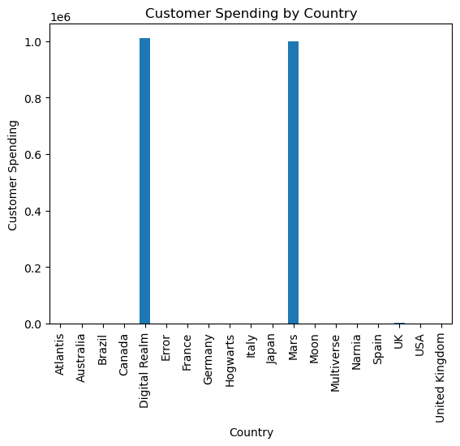

```python
# Import libraries
import pandas as pd
import matplotlib.pyplot as plt

# Part 1: Reading and Analyzing Data
print("# --- Reading data from CSV file --- #")

df = pd.read_csv('dataset-sell4all.csv', on_bad_lines='skip')  


print("# --- Displaying the first 5 rows of the data --- #")
print(df.head())

print("# --- Displaying a technical summary of the data --- #")
print(df.info())

print("# --- Converting columns to appropriate data types --- #")
df['Age'] = pd.to_numeric(df['Age'], errors='coerce')
df['Dépenses des clients'] = pd.to_numeric(df['Dépenses des clients'], errors='coerce')

print("# --- Re-displaying the technical summary after conversion --- #")
print(df.info())

print("# --- Calculating the mean and median of 'Age' and 'Customer Spending' columns --- #")
mean_age = df['Age'].mean()
median_age = df['Age'].median()
mean_spending = df['Dépenses des clients'].mean()
median_spending = df['Dépenses des clients'].median()

print(f'Mean Age: {mean_age}, Median Age: {median_age}')
print(f'Mean Spending: {mean_spending}, Median Spending: {median_spending}')

# Part 2: Data Visualization and Cleaning
print("# --- Creating a bar chart for customer spending by country --- #")
df.groupby('Pays')['Dépenses des clients'].sum().plot(kind='bar')
plt.title('Customer Spending by Country')
plt.xlabel('Country')
plt.ylabel('Customer Spending')
plt.show()

print("# --- Cleaning data: Removing rows with less than €10 spending --- #")
df = df[df['Dépenses des clients'] >= 10]

print("# --- Cleaning data: Removing duplicate rows --- #")
df = df.drop_duplicates()

print("# --- Writing cleaned data to a new CSV file --- #")
df_cleaned = df[['Pays', 'Age', 'Genre', 'Dépenses des clients']]
df_cleaned.to_csv('cleaned_dataset.csv', index=False)
print("Cleaned data written to 'cleaned_dataset.csv'")

```

    # --- Reading data from CSV file --- #
    # --- Displaying the first 5 rows of the data --- #
          Pays Age   Genre Dépenses des clients
    0   France  32  Female               150.50
    1  Germany  45    Male               200.75
    2    Spain  28  Female                75.25
    3    Italy  39    Male               180.00
    4       UK  52  Female               250.30
    # --- Displaying a technical summary of the data --- #
    <class 'pandas.core.frame.DataFrame'>
    RangeIndex: 64 entries, 0 to 63
    Data columns (total 4 columns):
     #   Column                Non-Null Count  Dtype 
    ---  ------                --------------  ----- 
     0   Pays                  64 non-null     object
     1   Age                   62 non-null     object
     2   Genre                 63 non-null     object
     3   Dépenses des clients  63 non-null     object
    dtypes: object(4)
    memory usage: 2.1+ KB
    None
    # --- Converting columns to appropriate data types --- #
    # --- Re-displaying the technical summary after conversion --- #
    <class 'pandas.core.frame.DataFrame'>
    RangeIndex: 64 entries, 0 to 63
    Data columns (total 4 columns):
     #   Column                Non-Null Count  Dtype  
    ---  ------                --------------  -----  
     0   Pays                  64 non-null     object 
     1   Age                   59 non-null     float64
     2   Genre                 63 non-null     object 
     3   Dépenses des clients  58 non-null     float64
    dtypes: float64(2), object(2)
    memory usage: 2.1+ KB
    None
    # --- Calculating the mean and median of 'Age' and 'Customer Spending' columns --- #
    Mean Age: 52.42372881355932, Median Age: 36.0
    Mean Spending: 34811.72948275862, Median Spending: 167.5
    # --- Creating a bar chart for customer spending by country --- #


    

    


    # --- Cleaning data: Removing rows with less than €10 spending --- #
    # --- Cleaning data: Removing duplicate rows --- #
    # --- Writing cleaned data to a new CSV file --- #
    Cleaned data written to 'cleaned_dataset.csv'


```python

```